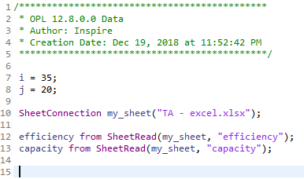
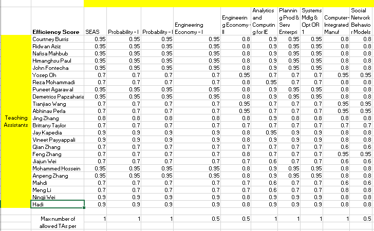
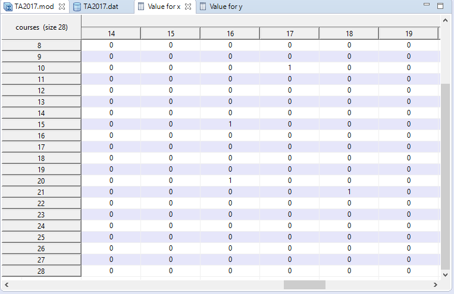
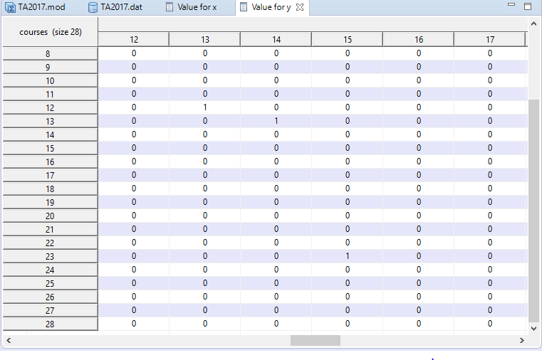
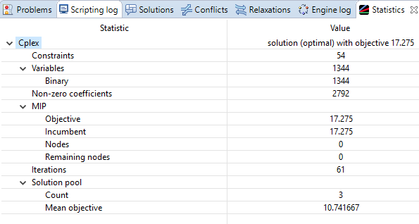
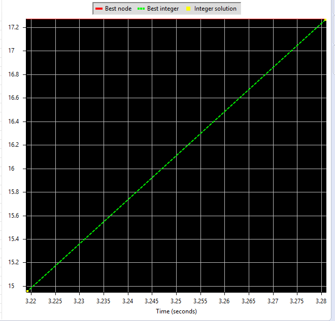

# Teaching-Assistant-Assignment-Problem
Building an optimization model that will generate the optimal allocation of teaching assistant to the courses, they may teach.

Authors:  **Priyesh Jain** 

---

## Dataset
- Spring 2018 TA Excel Sheet

- Number of courses (i) = 35
- Number of TAs (j) = 20

---

## Rules/Assumptions for determining parameters and constraints for the Optimization Model:

1.	Having a Teaching assistant assigned to a course strictly depends on the enrollment count and subject level (500 or 600 level course), so for few courses there is no necessity of having a teaching assistant.
2.	The maximum number of teaching assistant a particular course can have is a known value from the Dataset we have. (it can be 0.5, 1 or 1.5; with two pair combination)
3.	A half TA can work up to 10 hours per week and a full TA can work up to 20 hours per week. (Minimum is zero)
4.	For a particular course, a TA cannot be assigned as both half and full TA at the same time.
5.	For determining efficiency score, we need to know the PhD concentration and year of PhD of that particular TA and the course he/she may wish to teach.
5.1.	Teaching assistant in first year PhD are assigned General IE courses.
5.2.	 Teaching assistant in first year PhD or cannot take classes they are currently studying.
5.3.	 For senior year PhD students, efficiency is more when teach classes related to their specialization.

## Assigning Efficiency Score

## Optimization Model

Indices:
i= 1,2,3… for all course numbers in ISE department
j = 1,2,3… for all TAs in ISE department 

Sets:
- C = Set of all courses (Graduate courses and Undergraduate courses)
- T = Set of all TAs (Half TAs and Full TAs)

Parameters:
- Nimin = Minimum number of TAs that can be assigned for course ‘i’ (zero in our case)
- Nimax = Maximum number of TAs that can be assigned for course ‘i’
- Hj = Maximum number of available hours per week for half TA ‘j’ (10 hours in our case)
- Fj = Maximum number of available hours per week for full TA ‘j’ (20 hours in our case)
- eij = efficiency score ∈ [0, 1]

Decision Variables:
- Xij = 1, if half TA ‘j’ delivers course ‘i’ (where ‘i’ ϵ C, ‘j’ ϵ T)
    = 0, otherwise
- Yij = 1, if full TA ‘j’ delivers course ‘i’ (where ‘i’ ϵ C, ‘j’ ϵ T)
    = 0, otherwise
    
Objective Function:
Max Σ Σ eij (0.5Xij + Yij), for all ‘i’ in courses and ‘j’ in TAs

Constraints:
1.	Maximum number of half and full TAs a particular course can have:
 	Nimin <= 0.5 Σ Xij + Σ Yij <= Nimax (i = constant, j = 1, 2, 3…)

2.	Number of hours a half and a full TA can work/ Number of courses a particular TA can teach:
0 <= Hj * Σ Xij + Fj * Σ Yij <= 20 (i = 1, 2, 3…, j = constant)

...

## CPLEX Optimization Model

- Writing the Code

- Importing the excel file (TA - data.xlsx)

- Running Configuration

Output Results: Z = 14.875
The program code run without an error and there was no blocking pair in this stable matching. 

- Value of Decision Variables

## Running Same Model on fall 2017 Dataset

Assigning Efficiency Score:

Updating new file with new values for ‘i’ and ‘j’: 

Results: 

Decision Variables:

Objective Function Value: Z = 17.275

## Result Statistics

## Comparing the previous TA assignment and the optimization model assignment:

1.	In this optimization model, the value of ‘j’ can be reduced according to the budget of the department and can give desired allocation. In previous TA assignment, the allocation was purely based on the enrollment count and the concentration of PhD students.
2.	This optimization model will classify TAs into half and full, and make sure that the half TA and full TA will not exceed their number of hours per week.  
3.	In this model, the efficiency score can be adjusted on the basis of all factors including: Year of PhD, concentration of PhD, enrollment count of the course, whether the TA have studied that particular course before or not.
4.	The optimization model can give better efficiency and value of objective function for any dataset once the efficiency score is assigned properly. Here, we have assumed the previous dataset to be 90-95% efficient while assigning the efficiency score.  

 
